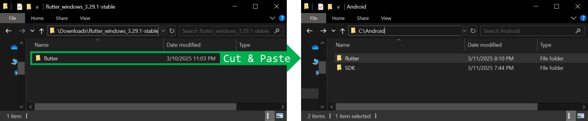

# [atet](https://github.com/atet) / [**_flutter_**](https://github.com/atet/flutter/blob/main/README.md#atet--flutter)

[](#nolink)

# Quickest Flutter Setup Yet!

*Want to stop messing with troubleshooting complex Flutter installations and start making apps?*

**Look no further!** Get up and running in 10 minutes by just installing the bare-bones dependencies needed for Android mobile development.

----------------------------------------------------------------------------

## Table of Contents

- [0. Requirements](#0-requirements)
- [1. Dependencies](#1-dependencies)
- [2. Setting up VSCode for Flutter](#2-setting-up-vscode-for-flutter)
- [3. Default Application Test](#3-default-application-test)
- [4. Next Steps](#4-next-steps)

### Supplemental

- [Other Resources](#other-resources)
- [Troubleshooting](#troubleshooting)

----------------------------------------------------------------------------

## 0. Requirements

- Unfortunately, there's no one-click install solution for this complex development environment
- This tutorial is only for Android mobile applications, which means less components
- Tested in Windows 10 (I'm sure this works for Windows 11 too)
- Need fast internet for ~1.5 GB of file downloads
- Do not have any prior installations of:
   - Java for Windows
   - Android SDK
   - VSCode

[Back to Top](#table-of-contents)

----------------------------------------------------------------------------

## 1. Dependencies

### Java (OpenJDK)

- Given Oracle's change of heart with Java 8, we'll use OpenJDK instead
- Directly download OpenJDK `v21.0.6` from: https://aka.ms/download-jdk/microsoft-jdk-21.0.6-windows-x64.msi
- Download through web browser and double-click the `*.msi` file to install
- During installation, change the settings below to have `JAVA_HOME` and JavaSoft (Oracle) registry keys overwritten

[](#nolink)

### Android SDK ***without*** the entire Android Studio

- Directly download Android SDK `v11076708` "Command line tools only" from: https://dl.google.com/android/repository/commandlinetools-win-11076708_latest.zip
- Download through web browser and extract in Downloads
- Create the following directory structure: `C:\Android\SDK\cmdline-tools\latest`
- Within the `latest` directory, cut or copy all of the contents in the `cmdline-tools` directory from the unzipped file above

[](#nolink)

- Open Command Prompt:

[](#nolink)

- Navigate to `C:\Android\SDK\cmdline-tools\latest\bin`:

```cmd
> cd C:\Android\SDK\cmdline-tools\latest\bin
```

- Run `sdkmanager` (you must respond to license prompt):

```cmd
> sdkmanager --install "platform-tools" "platforms;android-30" "build-tools;30.0.3" "emulator" "system-images;android-30;google_apis;x86_64"
```

- Then review licenses (REQUIRED, you must respond to **several** license prompts):

```cmd
> sdkmanager --licenses
```

- Create an Android Virtual Device (AVD) but do not start it (must start emulation through VSCode):

```cmd
> avdmanager create avd -n my_avd -k "system-images;android-30;google_apis;x86_64" --device "pixel"
```

- The above steps look like this:

[](#nolink)

### Flutter SDK

- Directly download Flutter `v3.29.1` SDK from: https://storage.googleapis.com/flutter_infra_release/releases/stable/windows/flutter_windows_3.29.1-stable.zip
- Download through web browser and extract in Downloads
- Navigate into the extracted directory and move the `flutter` subdirectory to the `C:\Android` directory you made earlier

[](#nolink)

- Configure flutter with Android SDK path by running this in Command Prompt:

```
> cd C:\Android\flutter\bin
> flutter config --android-sdk "C:\Android\SDK"
```

- In the Start Menu, search for "environment" and open the "Edit the system environment variables" entry
- Click on "Environment Variables" in the bottom-right of the popup

[](#nolink)

- Under "User variables," highlight the "Path" entry and click on "Edit"
- In the popup, Click on "New" and add the path to `C:\Android\flutter\bin` here
- Click "OK" to close out all windows
- If you have Command Prompt or VSCode open, you must restart them for these changes to take effect

[](#nolink)

[Back to Top](#table-of-contents)

----------------------------------------------------------------------------

## 2. Setting up VSCode for Flutter

### VSCode

- Directly download the latest version of VSCode Portable from: https://code.visualstudio.com/sha/download?build=stable&os=win32-x64-archive
- You can place this extracted directory anywhere you want, on your Desktop, in Program Files, etc.
- Create a new directory to store all your Flutter apps, let's create `C:\Android\Flutter Projects` for this tutorial
- Open VSCode by navigating to this extracted folder in File Explorer and executing `..\VSCode-win32-x64-1.98.1\Code.exe`
- On the top-left, click on Explorer (`CTRL+SHIFT+E`) and on "Open Folder" to set the current working directory to `C:\Android\Flutter Projects`
- VSCode will warn you about "trusted execution," reminding you that code you didn't write should be handled carefully

[](#nolink)

### Flutter Extension and Configuration

- On left-hand menu, choose Extensions (also, keyboard shortcut `CTRL+SHIFT+X`)
- Search for "Flutter"
- Install Flutter extension by Dart Code (may also install other extension dependencies like Dart)

[](#nolink)

- In the Command Palette (`CTRL+SHIFT+P`, it is **critical** to have the "`>`" character here), type "`> flutter`" and choose "`> Flutter: Run Flutter Doctor`"
- A popup in the bottom-right will ask about Flutter SDK, click on "Locate SDK" and point it to `C:\Android\flutter` and it will continue its diagnostic assessment
- A new pane will open at the bottom showing console output, you should have the following `[√]` marks:

```
[√] Flutter (REQUIRED)
[√] Windows Version (REQUIRED)
[√] Android toolchain (REQUIRED)
[X] Chrome (**Don't need this for Android Virtual Device emulation**)
[!] Visual Studio (**Don't need for AVD**)
[!] Android Studio (**Don't need for AVD**)
[√] Connected device (REQUIRED)
[√] Network resources (REQUIRED)
```

[Back to Top](#table-of-contents)

----------------------------------------------------------------------------

## 3. Default Application Test

### Create Default Application

- Now we can start a new project within your project folder, in the Command Palette, execute the following:
   - "`>Flutter: New Project`"
   - Choose "`Application`"
   - Select the current folder to create project in, "`C:\Android\Flutter Projects`"
   - Give the project a name or use default "`flutter_application_1`"
- This will take a few moments for Flutter to create the project

[](#nolink)

### Configure Device as Microsoft Edge Browser

- The default project has a simple working application, to build and run this application on our AVD, we need to **first successfully build it to the Microsoft Edge browser**
- In the Command Palette, run "`>Flutter: Select Device`"
- Then select "**Edge** edge - web"

[](#nolink)

- Click on the "`main.dart`" script and press `F5`, this will kick off the build and send the app over to a new Edge browser window
- This simple app is a counter that increments when you click on the bottom-right button, **cool!**
- Stop the app by pressing Stop (`SHIFT+F5`) in VSCode or by closing out the Edge window

[](#nolink)

### Building Default Application to AVD

- Now we will build and run this application on our AVD; in the Command Palette, run "`>Flutter: Select Device`"

[](#nolink)

- Then select "**Start my avd** mobile emulator&nbsp;&nbsp;&nbsp;&nbsp;&nbsp;&nbsp;&nbsp;Offline Emulators" which will boot up the AVD
- After the boot up sequence (**may take a minute to boot from black screen**)the AVD will show the home screen of the emulated phone, leave this open in the background
- Click on the "`main.dart`" script and press `F5`, this will kick off the build and send the app over to your AVD
- Now you've got the app running on a emulated Android phone, **magnificent!**
- Stop the app by pressing Stop (`SHIFT+F5`) in VSCode or by closing out the AVD window

[](#nolink)

[Back to Top](#table-of-contents)

----------------------------------------------------------------------------

## 4. Next Steps

**The sky is the limit!**

- Learn how to build your project into an [Android Package Kit (APK)](https://stackoverflow.com/a/51682414) so that you can deploy to a physical phone
- Configure additional components to build to a Windows desktop application or an iOS mobile app
- Interface your VSCode environment with large language models through [Continue.dev](https://www.youtube.com/watch?v=V3Yq6w9QaxI) and take your development to the next level

[Back to Top](#table-of-contents)

----------------------------------------------------------------------------

## Other Resources

**Description** | **URL Link**
--- | ---
Latest OpenJDK for Windows (x64) | https://learn.microsoft.com/en-us/java/openjdk/download#openjdk-21
Latest Android SDK "Command line tools only" (scroll all the way down) | https://developer.android.com/studio
Latest Flutter SDK (stable channel) | https://docs.flutter.dev/release/archive?tab=linux#stable-channel
Latest VSCode Portable (i.e., the `*.zip` version) | https://code.visualstudio.com/download
Android SDK without Android Studio | https://stackoverflow.com/a/42179456
Build Flutter app to APK | https://stackoverflow.com/a/51682414

[Back to Top](#table-of-contents)

----------------------------------------------------------------------------

## Troubleshooting

Issue | Solution
--- | ---
**"It's not working!"** | This concise tutorial has distilled hours of sweat, tears, and troubleshooting; _it can't not work_
**"Can I install this on WSL2 in Windows 10?"** | I spun my wheels on trying to get this installed on WSL2 in Windows 10; very long story short, it's likely not possible now due to [KVM in WSL only being supported in Windows 11](https://github.com/microsoft/WSL/issues/11216#issuecomment-2065238889)

[Back to Top](#table-of-contents)

----------------------------------------------------------------------------

<p align="center">Copyright © 2025-∞ Athit Kao, <a href="http://www.athitkao.com/tos.html" target="_blank">Terms and Conditions</a></p>